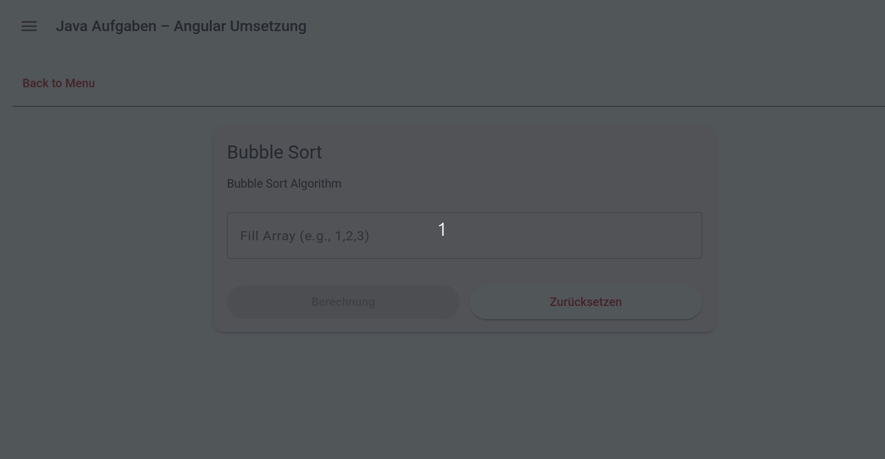
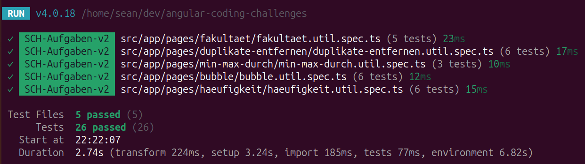

# Angular Coding Challenges

An interactive Angular application that transforms classic programming challenges into real-time, user-driven experiences.

The project emphasizes clean separation between business logic and UI, reusable component design, and testable TypeScript implementations.

**Live Demo:**  
https://seanconroy-dev.github.io/angular-coding-challenges/


> Example: Bubble sort with dynamic input
> 




## Key Technical Decisions

- Business logic is isolated in pure TypeScript utility modules to ensure testability and reuse
- UI components are kept lightweight and focused on presentation and interaction
- Each challenge is implemented as an independent feature module using Angular standalone components
- Real-time validation is handled through reactive input handling without unnecessary re-renders

## Architecture Overview

- **UI Layer:** Angular standalone components for each challenge
- **Logic Layer:** Pure TypeScript utility functions for algorithms
- **Routing:** Angular Router for navigation between challenges
- **Testing:** Unit tests targeting isolated logic modules

## Overview

This application provides interactive implementations of common coding challenges, allowing users to experiment with inputs and immediately see results.

The focus of the project is on:
- Implementing algorithms and core programming logic in TypeScript
- Separating business logic from the user interface
- Building reusable and structured Angular components
- Allowing users to validate implementations through custom inputs

Each challenge is represented by its own UI, where inputs can be entered and results are displayed immediately.

## Project Goal

The goal of this project is to translate typical programming exercises into interactive user interfaces, making algorithm behavior easier to explore, understand, and validate through interactive input.

## Implemented Coding Challenges

- Grade evaluation based on score input
- Weekday determination from numeric input
- Factorial calculation (n!)
- Counting vowels in a given text
- Minimum, maximum, and average value calculation
- Frequency analysis of numeric values
- Bubble sort algorithm
- Removing duplicate values from arrays

## Technologies Used

- Angular
- TypeScript
- HTML
- CSS
- Angular Routing
- Standalone Components

## Local Development

### Requirements

- Node.js (LTS recommended)
- Angular CLI

### Setup and Run

```bash
npm install
ng serve
```

The application will be available at:  
http://localhost:4200

## Deployment

This project is deployed using GitHub Pages.

## Testing

Core algorithm logic is validated with unit tests for the main utility modules.

Run the test suite locally with:

```bash
ng test --watch=false
```

The current test coverage includes:

- Bubble Sort
- Duplicate Removal
- Factorial
- Min / Max / Average
- Frequency Analysis

Example successful test run:



## License

This project is licensed under the MIT License.


