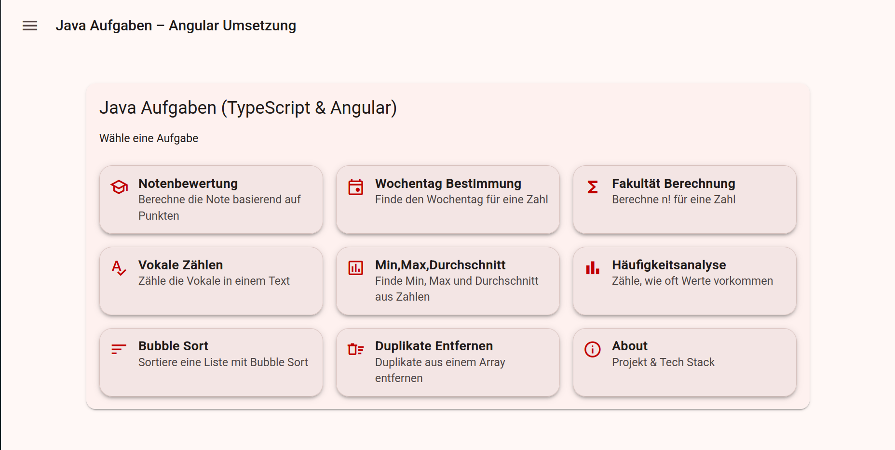

# Angular Coding Challenges

An interactive Angular application demonstrating common programming challenges with a focus on clean architecture, reusable components, and user-driven validation.

**Live Demo:**  
https://seanconroy-dev.github.io/angular-coding-challenges/



## What this project demonstrates

- Clear separation of business logic and UI
- Design of reusable and maintainable Angular components
- Handling dynamic user input and real-time output
- Implementation of core algorithms in TypeScript

## Overview

This application provides interactive implementations of common coding challenges, allowing users to experiment with inputs and immediately see results.

The focus of the project is on:
- Implementing algorithms and core programming logic in TypeScript
- Separating business logic from the user interface
- Building reusable and structured Angular components
- Allowing users to validate implementations through custom inputs

Each challenge is represented by its own UI, where inputs can be entered and results are displayed immediately.

## Project Goal

The goal of this project is to translate typical programming exercises into interactive user interfaces, making algorithm behavior easier to explore, understand, and validate through interactive input.

## Implemented Coding Challenges

- Grade evaluation based on score input
- Weekday determination from numeric input
- Factorial calculation (n!)
- Counting vowels in a given text
- Minimum, maximum, and average value calculation
- Frequency analysis of numeric values
- Bubble sort algorithm
- Removing duplicate values from arrays

## Technologies Used

- Angular
- TypeScript
- HTML
- CSS
- Angular Routing
- Standalone Components

## Local Development

### Requirements

- Node.js (LTS recommended)
- Angular CLI

### Setup and Run

```bash
npm install
ng serve
```

The application will be available at:  
http://localhost:4200

## Deployment

This project is deployed using GitHub Pages.

## Testing

Unit tests for core logic are planned to ensure correctness and maintainability.
Future improvements include adding test coverage for key algorithms and components.

## License

This project is licensed under the MIT License.


